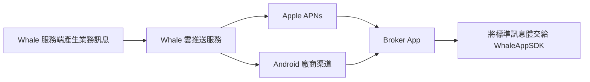
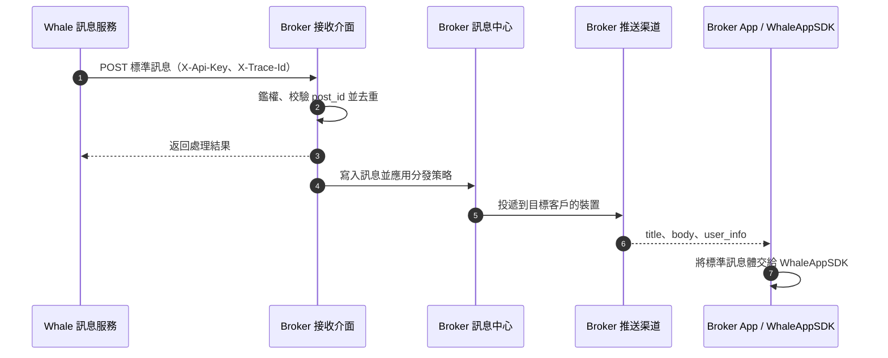

Whale 的訂單、帳戶及其他業務訊息可以透過兩種方式送達客戶：由 Whale 管理雲推送渠道並直接投遞到裝置，或先透過 Server-to-Server 介面轉發給 Broker，再由 Broker 自行決定是否通知及如何分發。

## 完整接入文件 {/* detailed-guides */}

本頁用於說明總體方案和責任邊界。原始對接材料中的配置項、欄位和完整示例分別保留在以下頁面：

- [訊息推送方案選擇](/zh-hk/docs/message-push-options)
- [推送渠道資訊收集](/zh-hk/docs/push-channel-credentials)
- [Broker 自有推送渠道](/zh-hk/docs/server-message-forwarding)

## 選擇接入方案 {/* choose-an-option */}

| 對比項 | Whale 託管推送 | Broker 自有推送 |
| --- | --- | --- |
| 訊息路徑 | Whale → 雲推送 → APNs / Android 廠商 → App | Whale → Broker Server → Broker 推送渠道 → App |
| Broker 服務端開發 | 無 | 需要實現訊息接收、處理和分發服務 |
| 雲推送配置 | Broker 將 App 渠道憑證安全提供給 Whale | Broker 自行管理，通常不向 Whale 提供廠商憑證 |
| 訊息控制能力 | 按 Whale 已配置的模板和策略投遞 | Broker 可決定過濾、合併、延遲和具體渠道 |
| 客戶端工作 | 註冊裝置，並將推送訊息交給 WhaleAppSDK | 註冊自有渠道，並將標準訊息體交給 WhaleAppSDK |
| 適用場景 | 希望快速上線、減少服務端工作 | 已有統一訊息平臺，或需要自主控制訊息分發 |

<Tip>
如果 Broker 已有成熟的訊息中心、營銷通知策略或多個下游渠道，通常選擇自有推送；如果目標是以較少的開發工作完成標準交易訊息通知，通常選擇 Whale 託管推送。
</Tip>

## 方案一：Whale 託管推送 {/* option-1-whale-managed-push */}



### 開通流程 {/* enablement-flow */}

1. Broker 確認生產與 UAT 的 iOS Bundle ID、Android Package Name 以及所需推送渠道。
2. Broker 在 Apple 或 Android 廠商控制檯建立 App、啟用推送能力並生成對應憑證。
3. Broker 透過雙方約定的加密渠道向 Whale 交付憑證資訊。
4. Whale 為相應環境建立並配置雲推送應用。
5. Broker App 完成系統通知許可權、裝置 token 註冊和 WhaleAppSDK 訊息處理。
6. 雙方分別驗證前臺、後臺、App 被終止及點選通知後的行為。

### Android 渠道資訊 {/* android-channel-information */}

不使用的渠道應明確標記為“不使用”。如果生產和 UAT 使用相同 Package Name，可以只提交一套資訊，但必須確認廠商控制檯是否允許兩套環境共用。

| 渠道 | 必填資訊 | 可選資訊 |
| --- | --- | --- |
| HUAWEI | Client ID、Client Secret | 預設回執 ID、實況窗服務賬號金鑰 |
| HONOR | App ID、Client ID、Client Secret | — |
| 小米 | App Secret | 海外 App Secret |
| FCM | 服務賬號金鑰 | — |
| OPPO | App Key、Master Secret | — |
| 魅族 | App ID、App Secret | — |
| vivo | App ID、App Key、App Secret | 預設回執 ID |

每套環境還應註明：

- 環境名稱：UAT 或生產。
- Android Package Name。
- 渠道控制檯內的 App 名稱或專案 ID。
- 憑證有效期、輪換聯絡人及計劃輪換時間。

### iOS APNs 資訊 {/* ios-apns-information */}

Broker 可以提供 APNs token signing key（`.p8`）或證書（`.p12`），通常只需選擇一種方式。

| 憑證方式 | 需要提供 |
| --- | --- |
| `.p8` | key 檔案、Key ID、Team ID、Bundle ID，以及適用環境 |
| `.p12` | 證書檔案、證書密碼、Bundle ID，並區分開發與生產環境 |

如果 UAT 與生產使用相同 Bundle ID，應在交付表中明確說明，不要透過猜測決定是否複用憑證。

<Warning>
推送憑證屬於生產秘密。不得放入 Git、普通文件、即時通訊明文、郵件正文或客戶端包內。應使用雙方批准的秘密交付渠道，並在交付後記錄保管人、使用範圍、到期時間和輪換方式。
</Warning>

## 方案二：Broker 自有推送 {/* option-2-broker-owned-push */}

Whale 將生成的標準業務訊息傳送給 Broker 的接收介面。 Broker 可以根據自身偏好完成過濾、模板渲染、使用者偏好判斷和多渠道分發。



### Broker 提供的資訊 {/* information-from-broker */}

- UAT 和生產環境的 HTTPS 接收地址。
- Whale 呼叫時使用的認證方式和金鑰安全交付流程。
- 網路白名單、TLS 和可選 mTLS 要求。
- 請求超時、最大請求體和速率限制。
- 技術聯絡人、監控方式和生產事件升級渠道。

### HTTP 請求約定 {/* http-convention */}

歷史對接方案使用 `POST`，並約定以下請求頭：

| Header | 說明 |
| --- | --- |
| `X-Api-Key` | Broker 提供給 Whale 的介面認證金鑰 |
| `X-Trace-Id` | 端到端鏈路追蹤標識；雙方日誌均應記錄 |

請求體示例：

```json
{
  "member_ids": ["1023310"],
  "template_key": "order_done_v2_lb",
  "post_id": "615066553171354100",
  "channel": "push",
  "language": "zh-CN",
  "title": "買入全部成交",
  "body": "股票名稱：示例股票\n成交數量：500",
  "template_params": {
    "quantity": "500",
    "order_id": "1228548293068333056"
  },
  "pre_params": {
    "member_real_name": "示例客戶"
  },
  "user_info": {
    "t": "order_done_v2_lb",
    "tn": "event-trace-id",
    "id": "615066553171354100",
    "lb_push_from": "whale",
    "link": "broker-app://trade/order-detail?id=1228548293068333056",
    "json": "{\"message_type\":\"order_done_v2_lb\"}"
  }
}
```

| 欄位 | 說明 | Broker 處理建議 |
| --- | --- | --- |
| `member_ids` | Whale 客戶標識列表 | 映射到 Broker 使用者和裝置，不要直接作為展示內容 |
| `template_key` | 訊息模板標識 | 用於模板路由；未知值應進入監控或相容處理 |
| `post_id` | 訊息唯一標識 | 作為冪等鍵，重複請求不得重複通知 |
| `channel` | 目標渠道 | 當前示例為 `push` |
| `language` | 訊息語言 | 用於選擇本地化模板或內容 |
| `title` / `body` | 已生成的標題和摘要 | 可直接展示，或按雙方確認規則重新渲染 |
| `template_params` | 業務模板引數 | 欄位隨模板變化，消費者應向前相容 |
| `pre_params` | Whale 內建預設引數 | 可能包含個人資料，按敏感資料處理 |
| `user_info` | 客戶端透傳資料 | 推送到 App 後原樣交給 WhaleAppSDK |

響應示例：

```json
{
  "success": true,
  "message": "success",
  "code": 0
}
```

歷史約定中 `code: 0` 表示成功，非 `0` 表示失敗。是否重試、重試次數、退避策略和可重試錯誤碼必須在上線前書面確認；接收方不能假定失敗一定會被再次投遞。

### 服務端實現要求 {/* broker-server-recommendations */}

- 僅接受 HTTPS，並校驗 `X-Api-Key`；生產金鑰應支援輪換。
- 使用 `post_id` 做冪等處理，併為去重記錄設定滿足業務要求的保留期。
- 快速完成校驗和可靠落庫，再非同步執行廠商推送，避免上游請求超時。
- 對未知的附加欄位保持相容，不因模板增加引數而拒絕整條訊息。
- 為鑑權失敗、校驗失敗、重複訊息、落庫失敗和下游推送失敗建立指標及告警。
- 日誌記錄 `X-Trace-Id`、`post_id` 和處理結果，但不得輸出金鑰或完整個人資料。
- 明確部分 `member_ids` 處理失敗時的響應和補償規則。

## 客戶端實現 {/* broker-app-implementation */}

無論選擇哪一種服務端路徑，最終交給 WhaleAppSDK 的訊息結構一致：

```json
{
  "title": "訊息標題",
  "body": "訊息摘要",
  "user_info": {
    "t": "訊息型別",
    "tn": "事件追蹤標識",
    "id": "訊息標識",
    "lb_push_from": "訊息來源",
    "link": "跳轉連結",
    "json": "業務內容 JSON 字串"
  }
}
```

整合 WhaleAppSDK 的 Broker App 需要完成：

1. 向作業系統申請通知許可權，並按照平臺要求取得裝置 token。
2. 將 token 註冊到所選推送服務，並在 token 更新、登入使用者變化或登出時同步更新綁定。
3. 在前臺收到訊息、後臺點選通知和冷啟動點選通知時，解析相同的標準結構。
4. 將 `title`、`body` 和完整 `user_info` 交給當前版本 WhaleAppSDK 的訊息處理入口。
5. 對 `link` 做允許列表和引數校驗後再導航，不能直接執行任意外部 URL 或未識別 scheme。
6. 對未知訊息型別或缺少可選欄位保持相容，並記錄可診斷但已脫敏的日誌。

<Note>
WhaleAppSDK 的具體方法名和初始化位置可能隨 iOS、Android 版本變化，應以專案交付的對應版本 SDK 文件為準。本頁定義的是穩定的責任邊界和訊息格式。
</Note>

## 聯調與驗收 {/* integration-and-acceptance */}

至少覆蓋以下場景：

- UAT 與生產 App 標識、憑證和訊息資料不會串用。
- 單個與多個 `member_ids` 均能正確映射目標客戶。
- 同一 `post_id` 重複投遞只產生一次使用者可見通知。
- App 位於前臺、後臺、被系統終止時均有明確行為。
- 客戶登出、切換帳戶或關閉通知許可權後不會錯誤投遞。
- 簡體中文、繁體中文、英文及預設語言符合產品約定。
- 通知點選能進入正確頁面，無效或過期連結能夠安全降級。
- Broker 接收介面超時、返回失敗及下游廠商失敗均可觀測。
- 金鑰輪換後舊金鑰按計劃失效，且訊息投遞不中斷。

訊息推送應作為上線驗收的一部分，連同帳戶、資金和交易主流程一起完成生產就緒檢查。完整交付階段見 [客戶接入與交付流程](/zh-hk/docs/broker-onboarding)。
