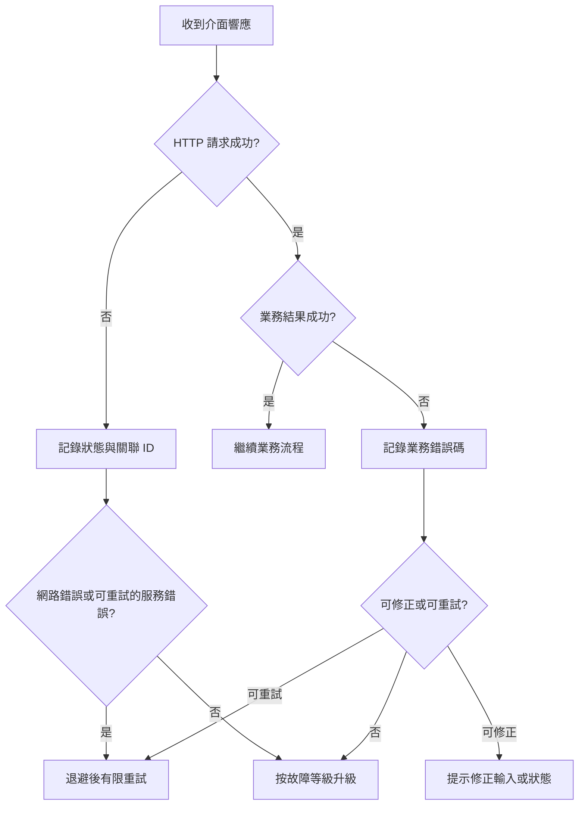

日常執行中需要排查問題時的入口：環境、錯誤處理、變更通知與支援升級路徑。

各 API 產品的具體錯誤模型與限制以對應產品欄目為準，例如 [Broker API 運維參考](/zh-Hant/broker-api/operations)。

## 環境與連通性

- 將測試與生產的訪問地址、出口 IP、DNS、TLS 和代理配置分別維護。
- 在寫業務程式碼前，用只讀介面驗證域名解析、TLS、白名單和憑證。
- 不要將歷史材料中的環境地址直接寫死；上線前向 Whale 專案團隊確認當前地址。
- 對連線失敗、超時和服務端錯誤設定有限次數重試與退避，業務失敗不能盲目重試。

## 錯誤處理

記錄 HTTP 狀態、響應體業務錯誤碼、請求關聯 ID、介面名稱和發生時間。日誌中的 token、金鑰、證件號碼和聯絡方式必須脫敏。

## 提交支援請求

為便於定位，支援請求應包含：環境、發生時間和時區、介面與方法、脫敏後的請求摘要、HTTP 狀態、業務錯誤碼、請求關聯 ID、影響範圍以及是否可以穩定復現。不要透過聊天或工單傳送金鑰和完整 Customer 敏感資料。

## 變更與生產事件

- 對 API、配置和欄位映射的變更保留版本及生效時間。
- 生產事件期間先控制影響，再收集證據和恢復服務。
- 事件關閉後記錄根因、恢復動作、遺留風險和防復發措施。
- 影響生產上線視窗的變更應同步更新上線步驟和回退方案。
