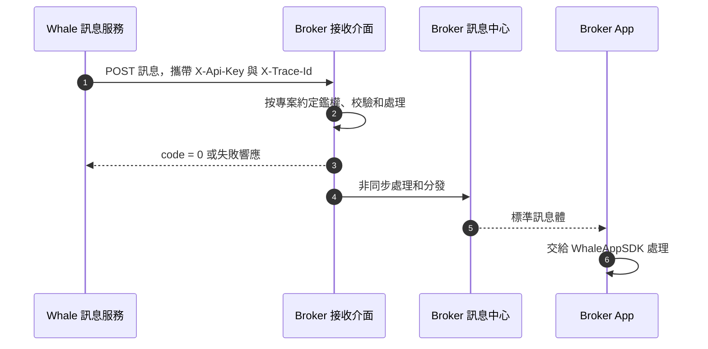

Whale 透過 Server-to-Server 介面把標準業務訊息轉發給 Broker Server。Broker 負責接收和下游分發；鑑權、冪等、可靠落庫和使用者映射方式需要在專案中確認。

## 接入流程



<Steps>
  <Step title="Broker 提供介面約定">
    Broker 提供 UAT 與生產 HTTPS 地址、認證方式、網路要求、超時限制和聯絡人。
  </Step>
  <Step title="Whale 配置轉發">
    Whale 將接收地址和認證資訊配置到對應環境，並使用測試訊息驗證連通性。
  </Step>
  <Step title="雙方完成訊息聯調">
    建議驗證正常訊息、重複 `post_id`、鑑權失敗、介面超時、返回失敗和多 Customer 訊息；實際範圍由雙方確認。
  </Step>
  <Step title="Broker App 驗收">
    驗證前臺、後臺、冷啟動、Customer 登出、通知許可權關閉和安全跳轉。
  </Step>
</Steps>

## HTTP 介面約定

**Method：** `POST`

| Header | 原始方案 | 說明 |
| --- | --- | --- |
| `X-Api-Key` | 提供 | Broker 提供給 Whale 的介面認證 Key；是否必填及輪換方式需確認 |
| `X-Trace-Id` | 提供 | 鏈路追蹤標識；格式、必填性和記錄方式需確認 |

### 請求欄位

下表根據原始請求示例整理，用於幫助閱讀，不替代雙方確認的正式介面契約；欄位型別、必填性及允許值需在專案中確認。

| 欄位 | 型別 | 說明 |
| --- | --- | --- |
| `member_ids` | `string[]` | Whale Customer 標識列表，Broker 需映射到自己的使用者與裝置 |
| `template_key` | `string` | 訊息模板 Key |
| `post_id` | `string` | 訊息唯一標識，應作為冪等鍵 |
| `channel` | `string` | 訊息渠道，當前示例為 `push` |
| `language` | `string` | 訊息語言，例如 `zh-CN` |
| `title` | `string` | 訊息標題 |
| `body` | `string` | 訊息摘要或正文 |
| `template_params` | `object` | 由具體模板定義的業務引數 |
| `pre_params` | `object` | Whale 內建預設變數，可能包含 Customer 資料 |
| `user_info` | `object` | 透傳給 Broker App 與 WhaleAppSDK 的訊息資料 |

### 通用請求示例

```json
{
  "member_ids": ["<member-id>"],
  "template_key": "<template-key>",
  "post_id": "<unique-message-id>",
  "channel": "push",
  "language": "zh-CN",
  "title": "訊息標題",
  "body": "訊息摘要",
  "template_params": {
    "key": "value",
    "date": "2026-01-21",
    "url": "https://example.com"
  },
  "pre_params": {
    "key": "value",
    "member_real_name": "示例 Customer"
  },
  "user_info": {
    "t": "<message-type>",
    "tn": "<trace-id>",
    "id": "<unique-message-id>",
    "lb_push_from": "xx",
    "link": "broker-app://example",
    "json": "{\"key\":\"value\"}"
  }
}
```

### 響應示例

```json
{
  "success": true,
  "message": "success",
  "code": 0
}
```

`code` 為 `0` 表示成功，非 `0` 表示失敗。原始方案註明失敗訊息目前不會重試；Broker 應據此設計接收處理，但實際成功判定和重試策略必須在專案上線前再次確認。

## 完整訂單訊息示例

```json
{
  "member_ids": ["<member-id>"],
  "template_key": "order_done_v2_lb",
  "post_id": "<unique-message-id>",
  "channel": "push",
  "language": "zh-CN",
  "title": "買入 全部成交",
  "body": "股票名稱：示例股票（00001.HK）\n成交數量: 500\n成交價格: 16.0000\n帳戶：示例綜合帳戶（<account-no>）\n交易方向：買入\n訂單型別：增強限價單\n有效期：當日有效\n委託數量：500\n委託價格：13.6000\n\n\n示例證券有限公司",
  "template_params": {
    "st": "CS",
    "gtd": "2026.04.14T16:00:00+08:00",
    "qty": "500",
    "code": "2333",
    "doom": "2026-04-14",
    "eqty": "500",
    "time": "",
    "price": "13.6000",
    "action": 1,
    "eprice": "16.0000",
    "market": "",
    "orderID": "<order-id>",
    "orderTag": 1,
    "originId": "<account-no>",
    "orderType": "ELO",
    "cancel_qty": "",
    "messageType": "order_done_v2_lb",
    "timeInForce": 1,
    "tickerRegion": "02333.HK",
    "accountChannel": "lb",
    "multilegDetail": "",
    "multilegStrategy": 0,
    "stock_counter_id": "ST/HK/2333",
    "multilegCombinedCode": ""
  },
  "pre_params": {
    "org_id": "1",
    "org_name": "示例證券有限公司",
    "member_id": "<member-id>",
    "account_aaid": "<account-aaid>",
    "member_email": "",
    "account_email": "customer@example.com",
    "member_app_id": "longbridge",
    "sender_prefix": "Longbridge",
    "account_org_id": "1",
    "member_account": "<member-account>",
    "org_short_name": "示例證券",
    "account_channel": "lb",
    "member_language": "zh-CN",
    "member_timezone": "Asia/Shanghai",
    "org_check_title": "Long Bridge HK Limited",
    "account_language": "zh-CN",
    "member_real_name": "LB",
    "org_account_name": "示例綜合帳戶",
    "org_phone_number": "+852 0000 0000",
    "account_member_id": "<account-member-id>",
    "account_real_name": " LB",
    "account_account_no": "<account-no>",
    "member_user_region": "CN",
    "org_recipient_name": "開戶部",
    "member_phone_number": "+86 13800000000",
    "account_phone_number": "+86 13900000000",
    "org_delivery_address": "示例機構地址",
    "org_check_description": "至少 10,000 港幣或 1,500 美元的香港銀行帳戶支票。",
    "member_phone_number_suffix": "2596",
    "account_phone_number_suffix": "5021",
    "member_privacy_phone_number": "86-888****2596",
    "account_privacy_phone_number": "86-666****5021"
  },
  "user_info": {
    "t": "order_done_v2_lb",
    "tn": "43c13033d04444f9b0e9ca8ac12441be",
    "id": "<unique-message-id>",
    "lb_push_from": "",
    "link": "lb://page/trade/order_detail?id=<order-id>&account_channel=lb",
    "json": "{\n  \"message_type\": \"order_done_v2_lb\"\n}"
  }
}
```

## SDK 訊息對接格式

Broker App 從自有推送渠道取得訊息後，需要保留 `title`、`body` 和完整 `user_info`，並交給 WhaleAppSDK 的訊息處理入口。

```jsonc
{
    "title": "訊息標題", // WhaleAppSDK 需要
    "body": "訊息摘要",
    "user_info": {
        "t": "xx", // 訊息型別或埋點欄位
        "tn": "xx", // 追蹤或埋點欄位
        "id": "xx", // 訊息標識
        "lb_push_from": "xx", // 原始欄位用於判斷訊息來源，具體取值需確認
        "link": "跳轉連結",
        "json": "業務內容 JSON 字串"
    }
}
```

<Warning>
Broker App 必須校驗 `link` 的 scheme、目標和引數後再跳轉，不能直接執行未識別的外部 URL。未知訊息型別應安全降級，不應導致 App 崩潰。
</Warning>

## 已有模板檔案

- `pre_function`：內建函式說明；當前已使用的函式包含在模板檔案中

- `templates`：模板定義

- `template_locales`：模板多語言內容及配置

[下載完整模板檔案](/files/whalesdk/gbltpl.zip)

```text
tpl.xxx 從請求體的 template_params 讀取引數。
pre.xxx 從請求體的 pre_params 讀取引數。

例如模板表示式 {{stock_name(tpl.stock_counter_id)}}
對應的請求引數為：

template_params: {
  stock_counter_id: "ST/US/BABA"
}
```
