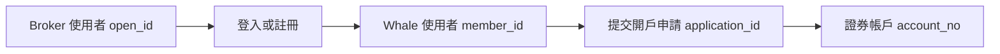

Broker App 涉及 Customer 的註冊、登入、鑑權和證券帳戶狀態管理。接入時可採用以下兩種模式。

<CardGroup cols={2}>
  <Card title="Broker 管理使用者體系" icon="users">
    使用者資料儲存在 Broker 系統；開戶時才透過 Broker API 建立 Customer 與 Whale 使用者及證券帳戶的關聯。
  </Card>
  <Card title="使用 Whale 使用者體系" icon="key">
    Broker 完成初始登入銜接，並將 Whale 返回的憑證交給 WhaleApp SDK 或 WhaleCore SDK；後續校驗與續期由 SDK 層管理。
  </Card>
</CardGroup>

## Broker 管理使用者體系

使用者資訊儲存在 Broker 系統。Broker 需要持久化 `open_id`、`member_id`、開戶申請和證券帳戶之間的映射，並以本地狀態驅動 Broker App 展示。

<Steps>
  <Step title="建立使用者關聯">
    Customer 首次開戶時，Broker 使用 `open_id` 呼叫登入註冊介面，獲得 Whale 的 `member_id`。同一 Customer 後續應複用既有映射。
  </Step>
  <Step title="提交併儲存開戶申請">
    Broker 提交開戶資料後儲存 `application_id`，並將本地帳戶狀態更新為“待開戶”。
  </Step>
  <Step title="同步證券帳戶狀態">
    在開戶成功前，Broker 定期呼叫 Broker API 查詢申請狀態；成功後儲存 `account_no`，之後常規查詢可優先使用 Broker 已儲存的結果。
  </Step>
  <Step title="處理帳戶註銷">
    Broker 儲存「待註銷」狀態，並在狀態最終確認前持續向 Broker API 查詢帳戶狀態。
  </Step>
</Steps>

### 建議的本地狀態

| 狀態 | 含義 | Broker App 建議 |
| --- | --- | --- |
| 未開戶 | 尚未提交開戶申請 | 展示開戶入口 |
| 待開戶 | 已提交，仍在非同步處理 | 展示處理中並允許重新整理狀態 |
| 開戶成功 | 已獲得可用證券帳戶 | 儲存並使用 `account_no` |
| 開戶失敗 | 申請失敗 | 展示失敗原因並按狀態判斷能否重試 |
| 待註銷 | 已發起註銷但未最終完成 | 持續查詢帳戶狀態 |

## 使用 Whale 使用者體系

Broker 服務端負責完成初始使用者登入或綁定，並把 Whale 返回的初始憑證安全交給 Broker App。Broker App 隨後將 `token` 與 `refresh_token` 設定到 WhaleApp SDK；完全自行實現證券功能 UI 時，則設定到 WhaleCore SDK。兩者後續都由 Whale SDK 層管理憑證。

<Steps>
  <Step title="取得初始憑證">
    登入成功後，Broker API 返回 `token` 和 `refresh_token`。Broker 只需按專案約定安全地把初始憑證交給 Broker App。
  </Step>
  <Step title="設定到 Whale SDK 層">
    Broker App 在初始化時將初始憑證設定到 WhaleApp SDK；使用 WhaleCore SDK 的 Broker App 則設定到 WhaleCore SDK。Broker App 不需要自行呼叫 check token。
  </Step>
  <Step title="由 SDK 自動校驗和續期">
    WhaleApp SDK 或 WhaleCore SDK 根據 token 有效期自行校驗並使用 refresh token 自動續期。正常情況下，只要續期持續成功，Broker 可以把 Customer 會話視為長期有效。
  </Step>
  <Step title="處理極低機率的續期失敗">
    如果憑證被統一 revoke、refresh token 無法使用或出現其他不可恢復的鑑權異常，SDK 會通知 Broker App。Broker App 此時銷燬 SDK 會話，並將整個 App 退回登出狀態，重新執行登入銜接。
  </Step>
</Steps>

<Warning>
Broker App 不應自行實現 token 有效期判斷、check token 或 refresh token 續期，也不應與 WhaleApp SDK / WhaleCore SDK 同時維護兩套刷新狀態。Broker 服務端仍必須對自己直接處理的資源執行歸屬和越權檢查。
</Warning>

下一步請參閱[使用者綁定與證券帳戶開戶](/zh-hk/docs/account-opening)，瞭解關聯欄位、開戶狀態和介面呼叫順序。
