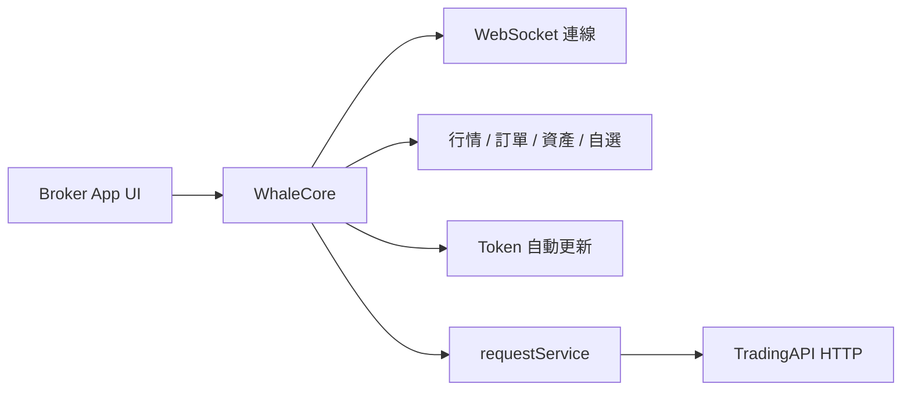

Broker App 如果希望完全自行實現證券功能 UI，可以組合使用 **WhaleCore** 和 **TradingAPI**。

- **WhaleCore** 是 Whale SDK 產品族中的無 UI 資料 SDK，負責連線、工作階段與鑑權基礎能力，並且是 TradingAPI 的唯一呼叫通道。
- **TradingAPI** 是由 WhaleCore 呼叫的 HTTP 介面，提供帳戶、資產、交易等業務能力，用於補充 WhaleCore 尚未類型化封裝的部分。

<Warning>
TradingAPI 只能透過 WhaleCore 的 `requestService()` 呼叫。簽名、鑑權標頭、公共參數以及鑑權失效後的復原重試都由 WhaleCore 的受管工作階段完成，Broker App 或 Broker Server 繞開 WhaleCore 直接請求 TradingAPI 端點會呼叫失敗。本文件中的介面定義用於說明請求路徑、參數和回應結構，供構造 `requestService()` 請求時參考。
</Warning>

## 組合架構 {/* combined-architecture */}

## 呼叫方式 {/* how-to-call */}

Broker App 提供介面路徑、查詢參數和請求主體，由 WhaleCore 發出請求並回傳原始回應；呼叫需要交易鑑權的介面時另需宣告交易 token 要求，SDK 在傳送前自動完成交易鑑權。行情、訂單、資產、自選等 WhaleCore 已經類型化封裝的能力請直接使用對應的 Service，不必經 TradingAPI 重複實現。

各平台的請求類型、範例程式碼和錯誤資訊見：

- [iOS 通用 HTTP 請求](/zh-hk/whalesdk/whalecore/ios#general-http-requests)
- [Android 通用 HTTP 請求](/zh-hk/whalesdk/whalecore/android#general-http-requests)
- [TypeScript 通用 HTTP 請求](/zh-hk/whalesdk/whalecore/typescript#general-http-requests)

## 平臺狀態 {/* platform-status */}

| 平臺 | WhaleCore 形態 | 狀態 |
| --- | --- | --- |
| iOS | 原生客戶端庫 | 可用 |
| Android | 原生客戶端庫 | 可用 |
| Web | WebAssembly | 可用 |

## API 覆蓋範圍 {/* api-coverage */}

側邊欄中已列出的 TradingAPI 介面可以直接用於開發，介面路徑、參數和回應與當前服務一致。

TradingAPI 的介面整理仍在進行中，更多介面會陸續補充到本文檔。如果所需能力尚未列出，請與 Whale 專案團隊確認該介面的當前狀態和可用時間。

## 何時使用 {/* when-to-use */}

- 需要完全控制資訊架構、視覺設計和互動體驗。
- 已有自己的行情、資產和交易頁面，不希望嵌入 Whale 提供的 UI。
- 願意在 WhaleCore 之上自行組合資料流、HTTP 業務介面、頁面狀態和錯誤恢復。

如果希望直接獲得完整圖形介面，應選擇 [WhaleAppSDK](/zh-hk/whalesdk/whaleapp/overview)：iOS、Android 或 WebTrade。

<Note>
WhaleCore 只提供基礎機制，不包含圖形介面，也不會替 Broker App 組合完整業務流程。具體庫、TradingAPI 端點和版本相容矩陣由 Whale 專案團隊按接入範圍提供。
</Note>
