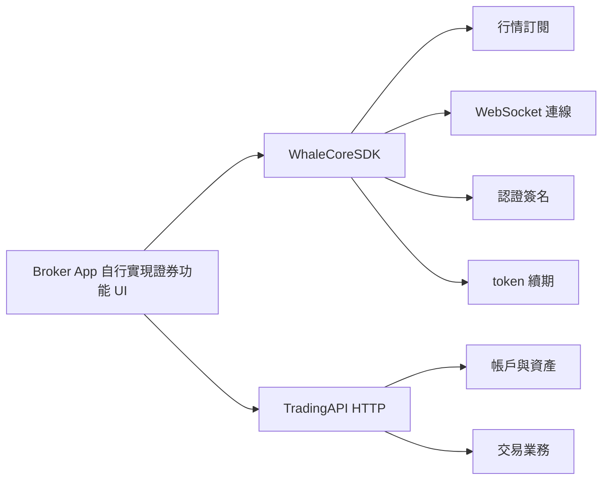

Broker App 如果希望完全自行實現證券功能 UI，可以組合使用 **WhaleCoreSDK** 和 **TradingAPI**。

- **WhaleCoreSDK** 是 WhaleSDK 產品族中的無 UI 資料 SDK，負責適合在 Broker App 中封裝的連線與會話基礎能力。
- **TradingAPI** 是以單個 Customer 身份授權的 HTTP API，提供帳戶、資產、交易等業務能力。

## 組合架構

## 平臺狀態

| 平臺 | WhaleCoreSDK 形態 | 狀態 |
| --- | --- | --- |
| iOS | 原生客戶端庫 | 可用 |
| Android | 原生客戶端庫 | 可用 |
| Web | WebAssembly | 開發中 |

## 何時使用

- 需要完全控制資訊架構、視覺設計和互動體驗。
- 已有自己的行情、資產和交易頁面，不希望嵌入 Whale 提供的 UI。
- 願意自行組合資料流、HTTP 業務介面、頁面狀態和錯誤恢復。

如果希望直接獲得完整圖形介面，應選擇 [WhaleAppSDK](/zh-hk/whalesdk/whaleapp/overview)：iOS、Android 或 WebTrade。

<Note>
WhaleCoreSDK 只提供基礎機制，不包含圖形介面，也不會替 Broker App 組合完整業務流程。具體庫、TradingAPI 端點和版本相容矩陣由 Whale 專案團隊按接入範圍提供。
</Note>
