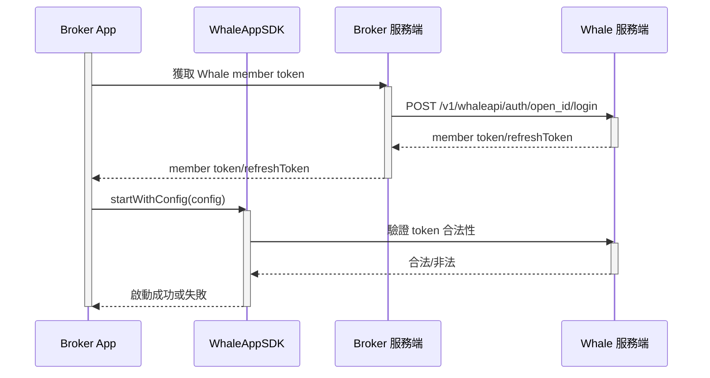

WhaleAppSDK 為 Broker App 內嵌一套可直接上線的證券業務體驗——行情、資產、交易、自選和資訊頁面開箱即用。Broker 仍然保留自己的帳戶體系和 App 外殼，只需要負責登入銜接和生命週期管理。

## 產品模組 {/* included-modules */}

| 模組 | 典型能力 |
| --- | --- |
| 行情 | 市場概覽、搜尋、報價、圖表、盤口和標的詳情 |
| 資產 | 即時計算總資產、盈虧等數據，多幣種折算，歷史盈虧等等 |
| 交易 | 港美股下單、訂單狀態、持倉、資產和成交記錄 |
| 自選 | 自選分組、標的同步和詳情導覽 |
| 資訊 | 市場與個股資訊、內容發現和可選社群體驗 |

## 頁面範例 {/* example-screens */}

<WhaleAppShowcase
  watchlistLabel="自選"
  marketLabel="行情"
  stockLabel="個股"
  assetsLabel="資產"
  newsLabel="資訊"
  ariaLabel="WhaleAppSDK 頁面範例"
  previousLabel="上一頁"
  nextLabel="下一頁"
/>

截圖僅供參考，最終可用模組和視覺效果取決於專案配置與 SDK 版本。

## 客製邊界 {/* customization-boundary */}

專案級可客製：圖示、顏色、外觀、淺色/深色/跟隨系統主題、英文/簡體中文/繁體中文、漲跌顏色模式、自訂字型和訊息推送方式。部分能力需要專案建置而非執行階段配置，具體範圍以 Whale 專案團隊確認的交付清單為準。

## 責任邊界 {/* responsibility-boundary */}

| WhaleAppSDK 提供 | Broker App 負責 |
| --- | --- |
| 行情、資產、交易等圖形介面 | 整合 SDK 交付包及處理依賴 |
| SDK 內部頁面路由 | 客戶登入及 Whale 憑證獲取 |
| SDK 內部網路請求、token 校驗及自動續期 | 提供初始憑證，並處理 SDK 報告的不可恢復鑑權失效 |
| 主題、語言和漲跌色能力 | 根據 Broker App 設定傳入初始值並同步變化 |
| 可識別訊息的展示和頁面跳轉 | 系統通知許可權、裝置 token 和非 Whale 訊息 |
| SDK 生命週期與錯誤回調 | 監控錯誤，並處理重新登入或降級 |

<Note>
文件中的 **Broker App** 指整合 WhaleAppSDK 的 Broker iOS 或 Android App。
</Note>

## 訊息推送方案選擇 {/* push-channel-choice */}

WhaleAppSDK 支援兩種訊息推送整合方案，需要 Broker 統一選定一種（iOS 與 Android 保持一致，不支援兩端各選一種）：

| 方案 | 適合 | Broker 需要準備 |
| --- | --- | --- |
| 方案一:使用 WhaleAppSDK 內建推送通道 | 希望整合成本最低，不想自建推送服務端 | 提供各平臺推送渠道憑證（iOS：APNs 憑證；Android：所需廠商推送渠道的 appId/secret） |
| 方案二:使用 Broker 自己的推送通道 | 已有自建推送體系，希望自行決定訊息是否推送給客戶 | 自行開發接收訊息的服務端介面，並提供給 Whale 專案團隊完成配置 |

兩種方案的具體整合方法見 [iOS 訊息推送](/zh-hk/whalesdk/whaleapp/ios#message-push) 和 [Android 訊息推送](/zh-hk/whalesdk/whaleapp/android#configure-push)。

## 啟動流程 {/* startup-flow */}

Broker App 啟動 WhaleAppSDK 前，需要先從 Broker 服務端換取 Whale 使用者憑證，再呼叫 SDK 的啟動方法：

## 平臺 {/* platforms */}

| 平臺 | 定位 | 指南 |
| --- | --- | --- |
| iOS | 嵌入 Broker iOS App 的原生 SDK 包 | [iOS](/zh-hk/whalesdk/whaleapp/ios) |
| Android | 嵌入 Broker Android App 的原生 SDK 包 | [Android](/zh-hk/whalesdk/whaleapp/android) |
| WebTrade | 獨立網域部署，或以 iframe 嵌入 Broker 官網，支援 PWA 安裝 | [WebTrade](/zh-hk/whalesdk/whaleapp/web) |

技術 FAQ 與參考效能數據見 [FAQ](/zh-hk/whalesdk/whaleapp/faq)。
