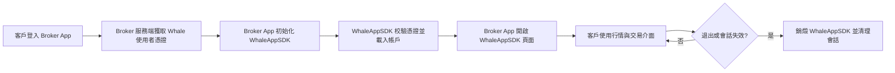

WhaleAppSDK for iOS 和 WhaleAppSDK for Android 向 Broker App 提供完整的證券業務圖形介面。Broker App 不需要重新實現行情、資產和交易頁面，主要負責整合 SDK、傳入客戶會話、承接系統能力及管理 App 生命週期。



## 責任邊界 {/* responsibility-boundary */}

| WhaleAppSDK 提供 | Broker App 負責 |
| --- | --- |
| 行情、資產、交易等圖形介面 | 整合 SDK 交付包及處理依賴 |
| SDK 內部頁面路由 | 客戶登入及 Whale 憑證獲取 |
| SDK 內部網路請求、token 校驗及自動續期 | 提供初始憑證，並處理 SDK 報告的不可恢復鑑權失效 |
| 主題、語言和漲跌色能力 | 根據 Broker App 設定傳入初始值並同步變化 |
| 可識別訊息的展示和頁面跳轉 | 系統通知許可權、裝置 token 和非 Whale 訊息 |
| SDK 生命週期與錯誤回調 | 監控錯誤，並處理重新登入或降級 |

<Note>
文件中的 **Broker App** 指整合 WhaleAppSDK 的 Broker iOS 或 Android App。
</Note>

## 接入前準備 {/* before-integration */}

從 Whale 專案團隊獲取與目標環境匹配的 SDK 交付包和配置：

- `appKey`、`appSecret`、`appId`。
- 預設帳戶渠道和 Web 域名字首等 Broker 配置。
- 客戶的 `token` 和 `refreshToken` 獲取方式。
- UAT、生產環境及允許的 App 標識。
- 如啟用 Whale 託管推送，對應平臺的推送 key、secret 和雲渠道配置。

測試與生產配置不得混用。任何憑證都不應出現在公開倉庫、示例日誌或截圖中。

## 通用生命週期 {/* shared-lifecycle */}

1. **安裝 SDK**：將專案團隊交付的版本整合到 Broker App，並解決依賴及構建配置。
2. **程序初始化**：在平臺規定的應用生命週期位置完成 SDK 基礎初始化。
3. **客戶登入**：Broker 完成自身登入後，從服務端取得 Whale 會話憑證。
4. **啟動 SDK**：傳入身份、App 名稱、主題、語言和 Broker 配置。
5. **等待就緒**：只有收到啟動成功回調後，才能呼叫頁面路由或依賴 SDK 狀態的能力。
6. **處理狀態變化**：響應不可恢復的 token 失效、主題和語言變化、外部 URL 以及訊息通知。
7. **退出與銷燬**：客戶登出、切換賬號或鑑權失效時銷燬 SDK，再清理 Broker App 會話。

## 配置模型 {/* configuration-model */}

兩端名稱略有差異，但核心配置一致：

| 配置 | 用途 |
| --- | --- |
| App 多語言名稱 | SDK 介面內展示 Broker App 名稱 |
| `appKey` / `appSecret` / `appId` | 標識專案與環境 |
| `token` / `refreshToken` | 當前客戶的 Whale 會話 |
| 預設帳戶渠道 | 指定專案配置的預設帳戶渠道 |
| Web 域名字首 | SDK 內 Web 內容使用的 Broker 域名配置 |
| 主題 | 跟隨系統、淺色或深色 |
| 語言 | 英文、簡體中文或繁體中文 |
| 漲跌色 | 跟隨 SDK 設定、紅漲綠跌或綠漲紅跌 |
| 高階配置 | 字型、顏色、裝置標識等專案級定製 |

## 回調處理 {/* callback-handling */}

Broker App 至少需要處理以下事件：

| 事件 | 建議處理 |
| --- | --- |
| SDK 啟動成功 | 關閉載入狀態並開放 WhaleAppSDK 頁面入口 |
| SDK 啟動失敗 | 記錄脫敏錯誤；配置錯誤由開發修復，鑑權錯誤引導重新登入 |
| SDK 執行時錯誤 | 對鑑權失效銷燬 SDK 並重新建立客戶會話 |
| token 自動續期 | 由 WhaleAppSDK 內部管理；Broker App 不自行呼叫 check token 或 refresh token 介面 |
| token 無法續期 | 銷燬 WhaleAppSDK 會話，並將 Broker App 退回登出狀態後重新登入 |
| SDK 請求開啟 URL | 先進行 scheme、域名和路由允許列表校驗，再交給 Broker App 路由 |
| SDK 即將銷燬 | 儲存必要狀態並關閉相關頁面 |

<Warning>
日誌不得輸出 `appSecret`、完整 token、refresh token 或客戶敏感資料。外部 URL 不能未經校驗直接執行。
</Warning>

## 訊息推送 {/* message-push */}

移動端均支援 Whale 託管推送和 Broker 自有推送兩種路徑。服務端渠道選擇、雲服務開通及訊息格式見 [訊息推送接入](/zh-hk/docs/message-push)；平臺方法見 [iOS 接入](/zh-hk/whalesdk/whaleapp/ios) 和 [Android 接入](/zh-hk/whalesdk/whaleapp/android)。

## 可選：行為埋點轉發 {/* optional-analytics-forwarding */}

部分專案可以申請將 WhaleAppSDK 內部埋點事件回調給 Broker App。該能力不是預設公共介面，需要 Whale 專案團隊確認 SDK 版本和授權範圍。

建議只消費雙方明確約定的事件，不依賴未承諾穩定的內部業務埋點。常見基礎事件包括頁面顯示、頁面離開、點擊及 SDK 啟動生命週期事件。

<Accordion title="Android 回調示例">

```kotlin
LBWhaleApp.callback = object : LBWhaleAppCallback {
    override fun onLBWhaleAppAnalyticsEvent(
        eventName: String,
        properties: org.json.JSONObject
    ) {
        // 按雙方約定轉發允許的事件和屬性
    }
}
```

</Accordion>

<Accordion title="iOS 回調示例">

```objective-c
- (void)lbWhaleAppAnalyticsEventWithName:(NSString *)name
                              properties:(NSDictionary *)properties {
    // 按雙方約定轉發允許的事件和屬性
}
```

</Accordion>

## 驗收清單 {/* acceptance-checklist */}

- 冷啟動、熱啟動和重複進入 WhaleAppSDK 頁面均正常。
- 啟動完成前不會呼叫依賴 SDK 就緒狀態的 API。
- WhaleAppSDK 自動續期無需 Broker App 介入；不可恢復的 token 失效、異地登入和客戶切換均有明確處理。
- 主題、語言、漲跌色和 Broker App 導航行為符合產品要求。
- 前臺、後臺、冷啟動和通知點擊路徑均已驗證。
- 登出後 SDK 頁面、網路活動和敏感狀態已被釋放。
- UAT 與生產使用各自的包、配置和推送渠道。
