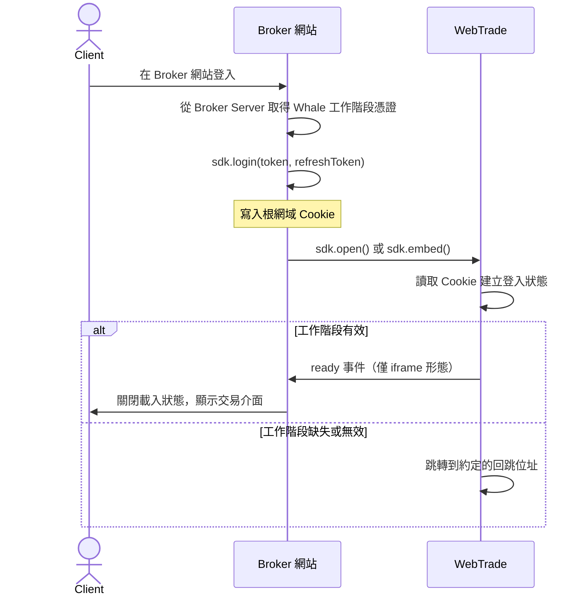
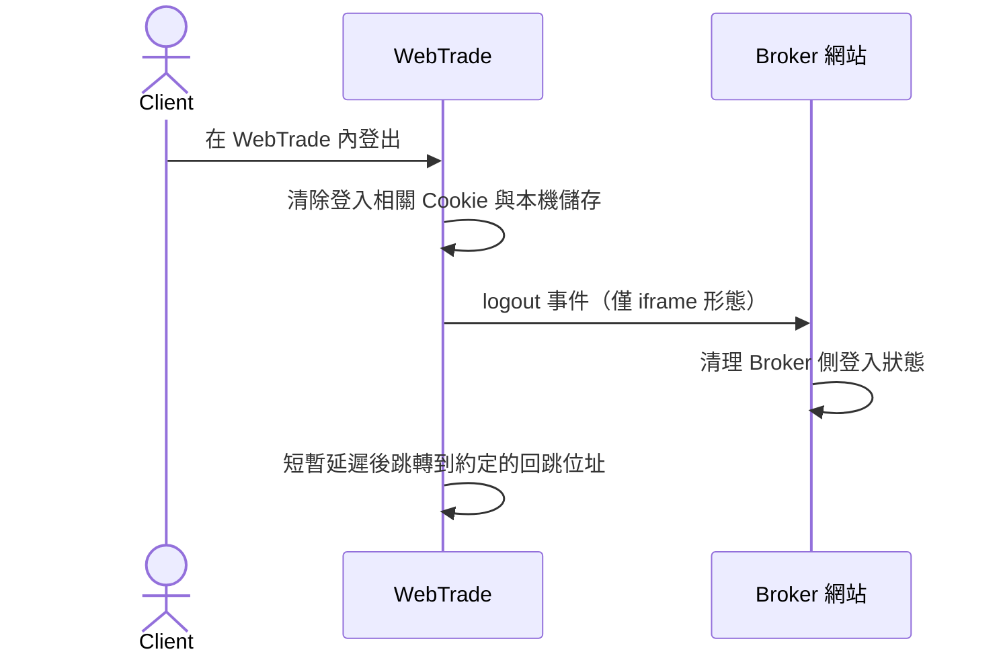

WebTrade 是 WhaleAppSDK 的 Web 形態，為 Broker 網站提供完整的證券業務介面。Broker 透過 WhaleAppSDK 的 JavaScript 程式庫完成整合：它寫入 SSO 所需的 Cookie、建立嵌入用的 iframe，並在 Broker 頁面與 WebTrade 之間傳遞語言、主題和漲跌色偏好。

本頁面向負責 Broker 網站前端的開發者。讀完後你可以選定整合形態、完成 SSO 與頁面嵌入，並處理 WebTrade 發來的事件和請求。

<Note>
本頁的 **Broker 網站**指承載 WebTrade 入口或 iframe 容器的 Broker 前端頁面，**Client** 指 Broker 的終端客戶。
</Note>

## 整合形態 {/* integration-model */}

WebTrade 提供兩種整合形態，Broker 按產品形態選擇其一。

|  | 新標籤頁 | iframe 嵌入 |
| --- | --- | --- |
| 呼叫方法 | `sdk.open()` | `sdk.embed()` |
| 顯示位置 | 瀏覽器新標籤頁 | Broker 頁面內的容器 |
| 通訊方式 | 共用 Cookie | 共用 Cookie 與 `postMessage` |
| 偏好切換後立即套用 | 否，重新開啟後生效 | 是 |
| 事件回呼 | 不可用 | `ready`、`logout` |
| 請求應答 | 不可用 | 可用 |
| 整合成本 | 低 | 中 |

### 責任邊界 {/* responsibility-boundary */}

| WebTrade 與 SDK 提供 | Broker 網站負責 |
| --- | --- |
| 報價、自選、交易、資產等業務介面 | 載入 SDK 並提供 WebTrade 部署位址 |
| Cookie 讀寫、根網域計算、iframe 建立與銷毀 | Client 在 Broker 側登入，並把 Whale 工作階段憑證交給 SDK |
| 語言、主題、漲跌色的寫入與傳遞 | 按 Broker 網站的當前設定呼叫偏好方法 |
| `postMessage` 信封、來源驗證、請求配對 | 實作事件回呼與請求應答的業務邏輯 |
| WebTrade 內部的 token 驗證與續期 | Whale 工作階段憑證更新後重新寫入 |

## 整合前準備 {/* before-integration */}

以下條件不滿足時 SSO 會失敗，且多數情況下沒有錯誤訊息，因此在寫程式碼前先逐項確認。

### 同一根網域 {/* shared-root-domain */}

Broker 網站與 WebTrade 必須部署在同一根網域的子網域下，這是透過共用 Cookie 實現 SSO 的前提。

```text
Broker 網站 → broker.example.com
WebTrade    → trade.example.com
共用根網域  → .example.com
```

<Warning>
根網域按網域的後兩段計算。網域使用二級後綴（例如 `.com.hk`、`.co.uk`）時，`trade.example.com.hk` 會得到 `.com.hk` 而非 `.example.com.hk`，Cookie 無法在兩個子網域之間共用，SSO 會靜默失敗。使用此類網域前請與 Whale 專案團隊確認。
</Warning>

跨根網域（例如 `broker-a.com` 與 `trade-b.com`）無法共用 Cookie，不能透過本方案完成 SSO。

### HTTPS {/* https-requirement */}

WebTrade 需要透過 HTTPS 存取。SDK 在 HTTPS 下寫入的 Cookie 帶 `Secure` 與 `SameSite=None`，前者要求 HTTPS，後者是 WebTrade 以跨來源 iframe 嵌入時 Cookie 可用的條件。

### 登記 Broker 網站 origin {/* register-origin */}

iframe 形態下，WebTrade 透過 Whale 側維護的允許清單驗證 `postMessage` 來源。**整合前請把 Broker 網站的 origin 提供給 Whale 專案團隊加入該清單**，否則 `ready`、`logout` 事件與請求應答都不會送達，Cookie SSO 不受影響。新標籤頁形態不使用 `postMessage`，無需登記。

### 與 Whale 約定的專案設定 {/* whale-side-configuration */}

WebTrade 的部分行為在交付時按專案設定，由 Whale 負責寫入，Broker 網站程式碼不涉及。整合時確認下列幾項即可。

| 能力 | 說明 |
| --- | --- |
| 登出回跳位址 | WebTrade 登出或無有效工作階段時跳轉的 Broker 位址，通常是 Broker 的登入頁。由 Broker 提供 |
| 隱藏 WebTrade 內的語言設定項 | 啟用後語言完全以 Broker 網站傳入的值為準，Client 無法在 WebTrade 內改語言 |
| 由 Broker 控制漲跌色 | 啟用後 WebTrade 載入時採用 Broker 傳入的漲跌色偏好，詳見[偏好同步](#preferences) |
| 隱藏 WebTrade 的登出入口 | 啟用後 Client 只能在 Broker 網站登出 |

SDK 使用的 Cookie 名稱固定、由 SDK 內部管理，無需 Broker 提供或約定。

<Tip>
建議隱藏 WebTrade 的登出入口，由 Broker 網站統一控制登入狀態，避免 Client 在兩處登出得到不同結果。
</Tip>

## 載入 SDK {/* install */}

SDK 以 UMD 格式透過 CDN 分發，不依賴建置工具：

```html
<script src="https://assets.lbctrl.com/sdk/webtrade/2.0.0/index.umd.js"></script>
```

載入後建構函式掛載在 `window.WhaleAppSDK`。SDK 不依賴第三方程式庫，瀏覽器支援範圍由 WebTrade 決定，請向 Whale 專案團隊索取目標環境的支援結論。

<Warning>
請鎖定到具體版本號。CDN 不提供 `latest` 路徑，以免 Broker 網站被動接受破壞性變更。升級版本前請閱讀該版本的變更說明。
</Warning>

SDK 寫入的 Cookie 使用 `whale_app_` 前綴，請不要在 Broker 網站的業務 Cookie 中使用相同前綴。

## 快速開始 {/* quickstart */}

兩段範例均假設 Client 已在 Broker 網站登入，且 Broker 已從 Broker Server 取得 Whale 工作階段憑證。

新標籤頁形態：

```html
<button id="trade-entry">進入交易</button>

<script src="https://assets.lbctrl.com/sdk/webtrade/2.0.0/index.umd.js"></script>
<script>
  const sdk = new WhaleAppSDK({ baseUrl: 'https://trade.example.com' })

  // Client 在 Broker 網站登入後寫入工作階段憑證
  sdk.login({ token: 'xxx', refreshToken: 'xxx' })

  document.getElementById('trade-entry').onclick = function () {
    sdk.open({ tab: 'quote' })
  }
</script>
```

iframe 形態：

```html
<div id="webtrade" style="width: 100%; height: 80vh;"></div>

<script src="https://assets.lbctrl.com/sdk/webtrade/2.0.0/index.umd.js"></script>
<script>
  const sdk = new WhaleAppSDK({ baseUrl: 'https://trade.example.com' })

  sdk.login({ token: 'xxx', refreshToken: 'xxx' })

  sdk.once('ready', function () {
    // WebTrade 已渲染，可關閉 Broker 頁面的載入狀態
  })

  sdk.on('logout', function () {
    // Client 在 WebTrade 內登出，執行 Broker 側登出邏輯
  })

  sdk.embed('#webtrade', { tab: 'quote' })
</script>
```

<Warning>
容器元素必須有明確高度。SDK 建立的 iframe 使用 `height: 100%`，容器高度為 0 時 WebTrade 不可見。
</Warning>

## 初始化 {/* initialize */}

```typescript
const sdk = new WhaleAppSDK({ baseUrl: 'https://trade.example.com' })
```

| 參數 | 型別 | 必填 | 說明 |
| --- | --- | --- | --- |
| `baseUrl` | `string` | 是 | WebTrade 部署位址。SDK 取其 origin 作為 `postMessage` 的目標與來源驗證依據 |

`baseUrl` 不是合法 URL 時建構函式會拋出錯誤。建議在應用啟動階段初始化，以便盡早發現設定錯誤。

## 登入與登出 {/* sign-in-and-sign-out */}

WebTrade 的 SSO 依賴 Cookie：Broker 網站寫入 Whale 工作階段憑證，WebTrade 載入時讀取並建立登入狀態。

### 寫入工作階段憑證 {/* write-session */}

```typescript
sdk.login({ token: 'xxx', refreshToken: 'xxx' })
```

| 參數 | 型別 | 說明 |
| --- | --- | --- |
| `token` | `string` | Client 的 Whale 工作階段 token |
| `refreshToken` | `string` | Client 的 Whale 更新 token |

兩個參數都不能為空，否則會拋出錯誤。Cookie 的作用範圍、有效期和跨網站屬性由 SDK 內部處理，Broker 不需要關心。

WebTrade 的登入只需要這兩個值。Broker 無需提供 `app_id`，它由 Whale 在專案建置設定中管理。

### 憑證更新後重新寫入 {/* renew-session */}

SDK 不判斷 token 是否過期，也不會主動續期，僅將傳入的值寫入 Cookie。**每次在 Broker 側重新取得 Whale 工作階段憑證後（續期、重新登入或其他原因），都要再呼叫一次 `login()` 覆寫舊值。**

```typescript
function onWhaleSessionUpdated({ token, refreshToken }) {
  sdk.login({ token, refreshToken })
}
```

`login()` 只更新 Cookie。已經載入的 WebTrade 不會在工作階段中途重新讀取，新值在 WebTrade 下次載入時生效——頁面重新載入，或重新呼叫 `embed()` 與 `open()`。

### 清除工作階段憑證 {/* clear-session */}

```typescript
sdk.logout()
```

方法清除 `token` 與 `refreshToken` 兩個 Cookie，保留語言、主題、漲跌色的偏好 Cookie，也不向 WebTrade 發送訊息。完整的登出流程見[登出流程](#logout-flow)。

## 由 Broker Server 寫入 Cookie {/* server-side-cookies */}

`login()` 是把工作階段憑證寫入 Cookie 的便捷方法。登入在 Broker Server 完成時，也可以由 Broker Server 直接透過 `Set-Cookie` 寫入，WebTrade 一樣用 JavaScript 讀取，此時 Broker 網站前端不必再呼叫 `login()`。

採用這種方式時，Cookie 必須滿足下列全部要求，否則 SSO 會靜默失敗。

| 要求 | 說明 |
| --- | --- |
| Cookie 名稱 | 與 SDK 寫入的一致，取值以整合約定為準 |
| 不設 `HttpOnly` | WebTrade 透過 JavaScript 讀取。Broker Server 簽發驗證 Cookie 時常預設帶 `HttpOnly`，必須明確關閉 |
| `SameSite=None; Secure` | WebTrade 以跨來源 iframe 嵌入，Cookie 需要在該情境中可用 |
| `Domain` 為根網域 | 例如 `.example.com`，使 Broker 網站與 WebTrade 兩個子網域都能讀取 |
| `Path=/` | 與 SDK 寫入行為一致 |
| HTTPS | `Secure` 屬性的前提 |

<Warning>
工作階段憑證 Cookie 必須可被 JavaScript 讀取，這是 Cookie SSO 的固有限制，由前端還是 Broker Server 寫入都一樣。如果 Broker 的安全規範要求驗證 Cookie 一律 `HttpOnly`，則本方案不適用於該 Cookie，請改用前端 `login()` 寫入的獨立 Cookie。
</Warning>

Broker Server 更新 Cookie 後同樣遵循上一節的規則：已載入的 WebTrade 需要重新載入才會讀到新值。

## 開啟與嵌入 {/* open-and-embed */}

### 新標籤頁開啟 {/* open */}

```typescript
sdk.open()
sdk.open({ tab: 'stock', symbol: '700.HK' })
```

方法以 `noopener,noreferrer` 在新標籤頁開啟 WebTrade，URL 由 `baseUrl` 與導覽參數組成。新標籤頁沒有父頁面，事件回呼與請求應答在此形態下不生效。

### 嵌入當前頁面 {/* embed */}

```typescript
const iframe = sdk.embed('#webtrade', { tab: 'quote' })
```

| 參數 | 型別 | 說明 |
| --- | --- | --- |
| `container` | `string \| HTMLElement` | CSS 選擇器或 DOM 元素 |
| `params` | `OpenParams` | 可選，初始導覽參數 |

方法回傳建立的 `HTMLIFrameElement`。已存在 iframe 時先銷毀再重建。iframe 使用 `width: 100%`、`height: 100%`、無邊框，並建立只接收來自 `baseUrl` origin 的訊息監聽。

### 銷毀 iframe {/* destroy */}

```typescript
sdk.destroy()
```

方法從 DOM 移除 iframe 並解除訊息監聽，已註冊的事件回呼與請求應答 handler 保留，下次 `embed()` 後繼續生效。適合在路由離開交易頁或 Client 登出時呼叫。

### 導覽參數 {/* navigation-parameters */}

`open()` 與 `embed()` 共用下列參數。

| 參數 | 型別 | 說明 |
| --- | --- | --- |
| `tab` | `'quote' \| 'stock' \| 'favorite' \| 'portfolio' \| 'stockSelect'` | 初始導覽位置：報價、個股詳情、自選、資產、選股器 |
| `symbol` | `string` | 初始標的 |

`symbol` 取 Whale API 回傳的標的識別碼，原樣傳入。回傳值形如 `700.HK`、`AAPL.US`（[`symbol` 格式](/zh-hk/docs/glossary#security-identifiers)），該格式僅供識別，請不要自行組合。

## 偏好同步 {/* preferences */}

三個偏好方法都做兩件事：寫入對應 Cookie 供 WebTrade 下次載入讀取，以及在存在 iframe 時發送 `postMessage` 通知 WebTrade 立即切換。新標籤頁形態下沒有 iframe，只有 Cookie 寫入生效。

| 方法 | 取值 | 含義 |
| --- | --- | --- |
| `sdk.setLang(lang)` | `en`、`zh-CN`、`zh-HK` | 英文、簡體中文、繁體中文 |
| `sdk.setTheme(theme)` | `dark`、`light` | 深色、淺色 |
| `sdk.setPriceColor(color)` | `green_up`、`red_up` | 綠漲紅跌、紅漲綠跌 |

```typescript
sdk.setTheme('dark')
sdk.setLang('zh-CN')
sdk.setPriceColor('red_up')
```

傳入未列出的取值時，WebTrade 分別回退到 `en`、`dark`、`red_up`。

### 初始偏好的判定順序 {/* initial-preferences */}

WebTrade 載入時按下列順序判定偏好。

**語言：** 語言 Cookie 的有效取值，其次是 `navigator.language` 中比對到的支援語言，最後回退到 `en`。

**主題：** 主題 Cookie 的取值，未設定時為 `dark`。

**漲跌色：** 僅當專案設定為「由 Broker 控制漲跌色」時，WebTrade 載入時才採用 Broker 寫入的偏好。未啟用時，漲跌色以 Client 在 Whale 的帳戶設定為準。

<Note>
該設定只影響載入時的取值來源。iframe 形態下 `setPriceColor()` 的切換不受它限制，一律立即生效；差別在於頁面重新載入後能否保留。
</Note>

## 事件 {/* events */}

WebTrade 透過 `postMessage` 發出兩個事件，SDK 接收後以回呼形式提供。**兩個事件都只在 iframe 形態下觸發。**

| 事件 | 觸發時機 | 典型處理 |
| --- | --- | --- |
| `ready` | WebTrade 渲染完成 | 關閉 Broker 頁面的載入狀態 |
| `logout` | Client 在 WebTrade 內登出 | 清理 Broker 側登入狀態並跳轉 |

```typescript
sdk.on('ready', callback)    // 註冊，同一事件可註冊多個回呼，按註冊順序觸發
sdk.once('ready', callback)  // 註冊一次，觸發後自動移除
sdk.off('ready', callback)   // 移除，須傳入註冊時的同一函式參照
```

回呼不接收參數。`embed()` 之前或之後註冊都有效，但建議在 `embed()` 之前註冊，避免 WebTrade 載入較快時錯過 `ready`。

```typescript
sdk.on('logout', () => {
  sdk.logout()      // 清除 SDK 寫入的工作階段憑證 Cookie
  sdk.destroy()     // 銷毀 iframe
  brokerSignOut()   // 清理 Broker 自身登入狀態
  window.location.href = '/login?from=webtrade'
})
```

<Warning>
多次呼叫 `embed()` 時事件回呼會保留。需要替換回呼時先用 `off()` 移除舊的，否則舊回呼仍會在新 iframe 的事件上觸發，可能導致重複跳轉。
</Warning>

## 請求應答 {/* request-response */}

部分業務情境下 WebTrade 需要向 Broker 網站發起帶回傳值的呼叫，並等待結果。呼叫方一律是 WebTrade，Broker 網站是應答方：Broker 為約定的方法註冊 handler，SDK 負責接收請求、呼叫 handler、回傳結果，並完成訊息信封、來源驗證與請求配對。**僅 iframe 形態可用。**

```typescript
sdk.handle('methodName', async (payload) => {
  const result = await yourBusinessLogic(payload)
  return result
})

sdk.unhandle('methodName')
```

| 參數 | 型別 | 說明 |
| --- | --- | --- |
| `method` | `string` | 方法名稱，與整合時約定的協定一致。重複註冊以最後一次為準 |
| `handler` | `(payload) => unknown \| Promise<unknown>` | 處理函式，可為 async。回傳值即結果 |

handler 可在 `embed()` 之前或之後註冊，並跨 `embed()` 與 `destroy()` 保留。建議在 `embed()` 之前註冊，避免錯過 WebTrade 載入初期發出的請求。

<Note>
具體的方法名稱、傳入參數與回傳結構以整合時 Whale 提供的協定為準，Broker 按協定實作對應 handler。
</Note>

### 回傳失敗 {/* handler-errors */}

handler 拋出帶**字串 `code`** 的物件時，該 `code` 原樣回傳給 WebTrade，供其按業務分支處理。`code` 是 Broker 與 Whale 在協定中約定的取值，SDK 不限定其範圍。

```typescript
sdk.handle('methodName', async (payload) => {
  const data = await query(payload)
  if (!data.available) {
    throw { code: 'NOT_AVAILABLE', message: '資源暫不可用' }
  }
  return data
})
```

<Warning>
`message` 會被 WebTrade 原樣顯示給 Client，因此必須是面向 Client 的可讀文案，並使用 Client 當前的語言。沒有合適文案時請省略該欄位，WebTrade 會使用自己的本地化文案；填入內部錯誤字串會頂掉這層文案，直接顯示給 Client。
</Warning>

SDK 另有兩個內建 `code`，均不帶文案，由 WebTrade 側文案兜底，同時在瀏覽器主控台輸出帶 `[WhaleAppSDK]` 前綴的警告。

| code | 含義 |
| --- | --- |
| `METHOD_NOT_FOUND` | 該方法沒有註冊 handler |
| `HANDLER_ERROR` | handler 拋出的值不帶字串 `code`，或回傳值無法被結構化複製 |

### 逾時與來源驗證 {/* rpc-boundaries */}

WebTrade 對每個請求設有逾時，預設 5 秒。逾時只表示 WebTrade 停止等待，不代表 Broker 側的處理失敗或未完成。handler 的正常耗時可能超過該閾值時，請提前與 Whale 專案團隊約定調整。

SDK 在應答前驗證訊息 origin 等於 `baseUrl` 的 origin，且來源是 SDK 建立的那個 iframe。任一條件不滿足時請求會被丟棄且不回傳。回傳時目標 origin 同樣精確取 `baseUrl` 的 origin，不使用萬用字元。

## 登入流程 {/* sign-in-flow */}



WebTrade 讀取工作階段憑證時，Cookie 優先於其本機快取。工作階段缺失或無效時，WebTrade 跳轉到整合時約定的 Broker 回跳位址；未約定時跳轉 Whale 登入頁。

## 登出流程 {/* logout-flow */}

Client 可能在 Broker 網站登出，也可能在 WebTrade 內登出（未隱藏登出入口時），兩條路徑都需要處理。

**Client 在 Broker 網站登出：** 呼叫 `sdk.logout()` 清除工作階段憑證 Cookie，呼叫 Whale 登出 API 使伺服器端 token 失效，iframe 形態下再呼叫 `sdk.destroy()`。

**Client 在 WebTrade 內登出：**



WebTrade 發出 `logout` 事件後會短暫延遲再執行自身跳轉，為 Broker 網站留出回應時間。超過該時間窗後 WebTrade 執行跳轉，未完成的回呼隨之中斷，因此 `logout` 回呼中的處理應當立即完成，不要等待網路請求回傳後才更新本機狀態。

新標籤頁形態下沒有父頁面，WebTrade 清除本機狀態後直接跳轉到約定的回跳位址。Broker 應在該位址對應的頁面上完成自身登出。

## Broker 側實作清單 {/* broker-implementation-requirements */}

上線前逐項確認：

- Broker 網站與 WebTrade 部署在同一根網域的子網域下，且均為 HTTPS。
- iframe 形態下，Broker 網站的 origin 已由 Whale 加入允許清單。
- Client 登入後呼叫 `login()`，且每次重新取得 Whale 工作階段憑證後再次呼叫。
- 工作階段憑證 Cookie 未被設定為 `HttpOnly`。
- Broker 網站登出時清除工作階段憑證 Cookie，並呼叫 Whale 登出 API 使伺服器端 token 失效。
- iframe 形態下已處理 `logout` 事件，且處理邏輯在延遲時間窗內完成。
- 已向 Whale 提供登出回跳位址，且該頁面能處理來自 WebTrade 的跳轉。
- 已按約定協定實作請求應答 handler，失敗分支回傳約定的 `code`，`message` 為面向 Client 的可讀文案。
- SDK 載入位址鎖定到具體版本號。

## 部署方式 {/* deployment */}

- **Whale 部署：** Whale 完成 WebTrade 的建置與部署，Broker 提供網域與專案設定。
- **Broker 自行部署：** Whale 交付為 Broker 定製建置的 WebTrade 壓縮檔，由 Broker 部署。適用於 Broker 自行管理憑證或需要多個網域的情況。

兩種方式的整合程式碼相同。
