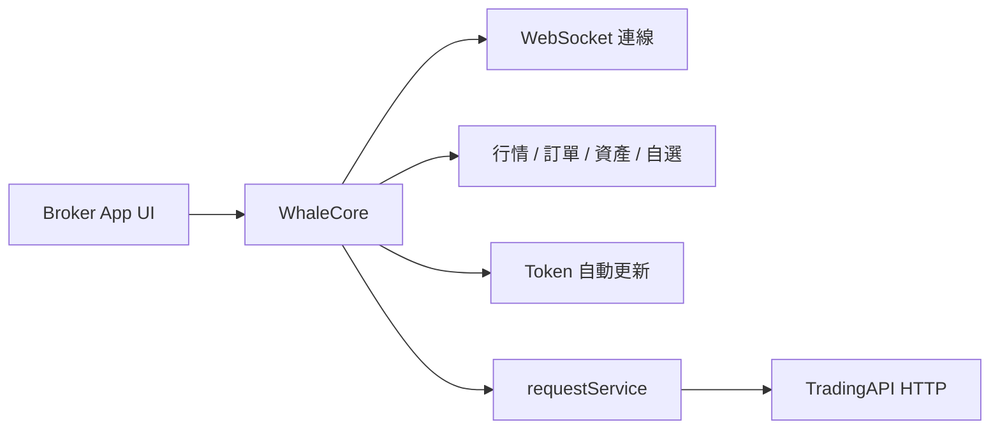

WhaleCore 是無 UI 的證券業務數據 SDK。Broker App 自行實作介面，透過 WhaleCore 管理客戶端工作階段、即時數據和業務服務；尚未由類型化 Service 封裝的能力，透過 WhaleCore 的 `requestService()` 呼叫 [TradingAPI](/zh-hk/trading-api/overview) 補充。TradingAPI 只能經 WhaleCore 呼叫，Broker App 或 Broker Server 繞開 WhaleCore 直接請求會失敗。

<Note>本文件根據 WhaleCore iOS 與 Android 原始碼中的公開介面整理。具體套件位置、版本相容矩陣、專案憑證和環境由 Whale 專案團隊提供。</Note>

## 適用場景 {/* when-to-use-it */}

<CardGroup cols={2}>
  <Card title="完全自訂 UI" icon="palette">Broker 自行設計證券業務頁面和互動，不使用 WhaleAppSDK 的現成介面。</Card>
  <Card title="重用客戶端基礎能力" icon="database">SDK 負責工作階段、鑑權復原、WebSocket、快取和業務數據服務。</Card>
</CardGroup>

## 公開能力 {/* public-capabilities */}

| 模組 | iOS 入口 | Android 入口 | 能力 |
| --- | --- | --- | --- |
| 行情 | `quoteService()` | `getQuoteService()` | 即時行情訂閱、K 線、分時資料、歷史逐筆成交、期權鏈 / 期權詳情訂閱、行情等級與裝置佔用 |
| 期權計算 | `WhaleCoreOptionCalculator`（靜態工具） | `OptionCalculator`（靜態工具） | 本機 Black-Scholes 計算：Greeks、理論價、內在 / 時間價值、到期天數、到期盈利概率 |
| 訂單 | `orderService()` | `getOrderService()` | 下單、改單、撤單、附加單、持倉止盈止損、訂單預覽、預估資訊、下單前置校驗、交易卡券選券、訂單事件推送 |
| 資產 | `portfolioService()` | `getPortfoliosService()` | 資產訂閱、現金明細、會員資產設定、盈虧分析（跨幣種換算由 SDK 內部完成，兩端均不提供匯率查詢介面） |
| 自選 | `watchlistService()` | `getWatchlistService()` | 分組與股票增刪改、排序、置頂、失效標的清理與事件 |
| 透傳請求 | `requestService()` | `getRequestService()` | 呼叫 TradingAPI 的唯一通道，自動加入公共參數與鑑權標頭，鑑權失效自動復原重試 |
| 交易權杖 | `updateTradeToken(_:...)` / `hasTradeToken()` | `updateTradeToken()` / `hasTradeToken()` | 僅交易密碼驗證模式（初始化傳 `tradePasswordEnabled`）需要：由 Broker App 驗證交易密碼後送入交易權杖；預設模式下 SDK 自動取得與續期 |

<Note>
  歷史獨立入口 `WhaleCoreService.orderValidationService`（iOS）與 `WhaleCore.getOrderValidationService()`（Android）已棄用，下單前置校驗請直接使用 `orderService()` / `getOrderService()` 上的同名方法。
</Note>

`CounterId` 是 SDK 使用的標的識別碼，例如 `ST/US/AAPL`、`ST/HK/00700`。

## 整合模型 {/* integration-model */}

## 平台 {/* platforms */}

| 平台 | 狀態 | 指南 |
| --- | --- | --- |
| iOS | 可用，iOS 13+，Swift / Objective-C | [iOS](/zh-hk/whalesdk/whalecore/ios) |
| Android | 可用，Kotlin / Java | [Android](/zh-hk/whalesdk/whalecore/android) |
| Web | 可用，瀏覽器內的 WebAssembly，TypeScript | [TypeScript](/zh-hk/whalesdk/whalecore/typescript) |
| Flutter | 可用，Android 與 iOS，Dart | [Flutter](/zh-hk/whalesdk/whalecore/flutter) |

