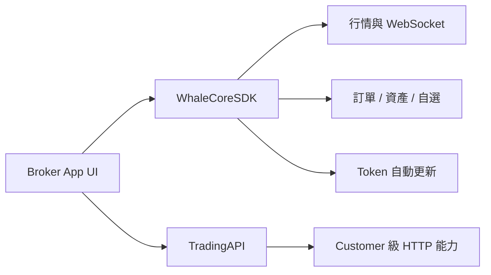

WhaleCoreSDK 是無 UI 的證券業務數據 SDK。Broker App 自行實作介面，透過 WhaleCore 管理客戶端工作階段、即時數據和業務服務，並以 TradingAPI 補充 Customer 級 HTTP 能力。

<Note>本文件根據 WhaleCore iOS 與 Android 原始碼中的公開介面整理。具體套件位置、版本相容矩陣、專案憑證和環境由 Whale 專案團隊提供。</Note>

## 適用場景

<CardGroup cols={2}>
  <Card title="完全自訂 UI" icon="palette">Broker 自行設計證券業務頁面和互動，不使用 WhaleAppSDK 的現成介面。</Card>
  <Card title="重用客戶端基礎能力" icon="database">SDK 負責工作階段、鑑權復原、WebSocket、快取和業務數據服務。</Card>
</CardGroup>

## 公開能力

| 模組 | iOS 入口 | Android 入口 | 能力 |
| --- | --- | --- | --- |
| 行情 | `quotesService` | `getQuoteService()` | 即時行情、K 線、快照、期權鏈 |
| 訂單 | `orderService` | `getOrderService()` | 下單、改單、撤單、查詢、預估與推送 |
| 下單校驗 | `orderService` | `getOrderValidationService()` | 可交易性、約束、資格與提交前校驗 |
| 資產 | `portfolioService` | `getPortfoliosService()` | 資產、持倉、現金明細與即時更新 |
| 自選 | `watchlistService` | `getWatchlistService()` | 分組、股票、排序、置頂與事件 |
| 透傳請求 | `requestService` | `getRequestService()` | 自動加入公共參數和鑑權的 HTTP 請求 |
| 交易鑑權 | Config delegate | `getTradeAuthService()` | trade token 取得、更新與狀態 |

`CounterId` 是 SDK 使用的標的識別碼，例如 `ST/US/AAPL`、`ST/HK/00700`。

| 平台 | 狀態 | 指南 |
| --- | --- | --- |
| iOS | 可用，iOS 13+，Swift / Objective-C | [iOS](/zh-hk/whalesdk/whalecore/ios) |
| Android | 可用，Kotlin / Java | [Android](/zh-hk/whalesdk/whalecore/android) |
| Web | WebAssembly 開發中 | 暫無公開接入指南 |

