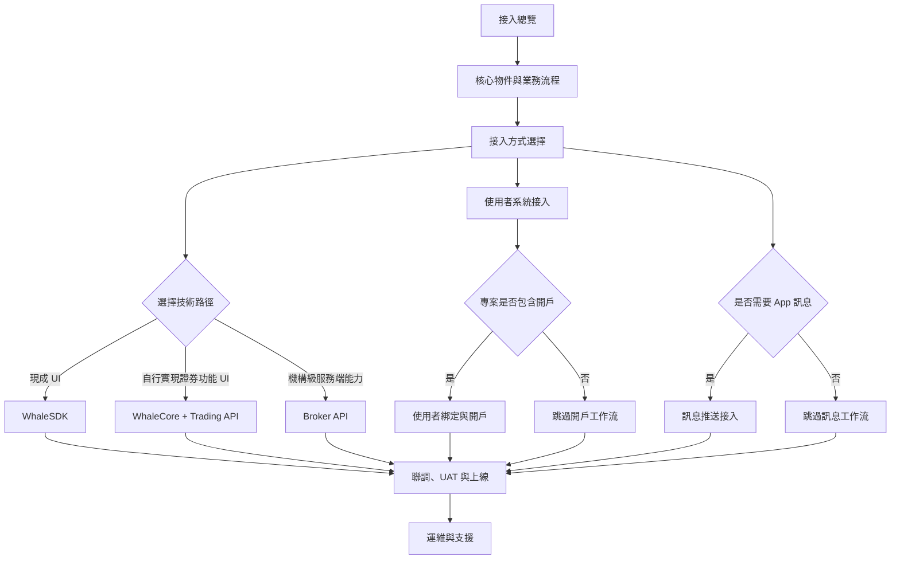
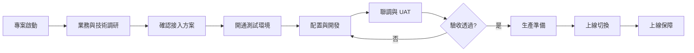

本指南面向首次接入 Longport Whale 的 Broker 專案團隊，說明雙方在商務確認後需要完成的準備、方案確認、環境開通、聯調驗收和上線工作。

<Note>
本頁是整個 Broker 接入的主入口。建議專案按階段形成可驗證的交付物；具體工作流和階段門檻應以雙方確認的專案範圍為準。
</Note>

## 指南路線

| 階段 | 指南 |
| --- | --- |
| 理解 Customer、使用者、開戶申請、帳戶和訊息的關係 | [核心物件與業務流程](/zh-Hant/docs/concepts) |
| 確定 UI、客戶端和服務端方案 | [接入方式選擇](/zh-Hant/docs/integration-options) |
| 確定 Customer 註冊、登入和會話歸屬 | [使用者系統接入](/zh-Hant/docs/user-system-integration) |
| 整合 Whale 提供的完整 UI | [WhaleSDK](/zh-Hant/whalesdk/overview) |
| Broker App 自行實現證券功能 UI | [WhaleCore 與 Trading API](/zh-Hant/trading-api/introduction) |
| 接入機構級服務端能力 | [Broker API](/zh-Hant/broker-api/overview) |
| 專案包含開戶時，建立使用者、申請和證券帳戶映射 | [使用者綁定與開戶](/zh-Hant/docs/account-opening) |
| 專案需要 App 訊息時，選擇並實現訊息鏈路 | [訊息推送接入](/zh-Hant/docs/message-push) |
| 執行測試、驗收和生產切換 | [聯調、UAT 與上線](/zh-Hant/docs/implementation) |
| 上線後的錯誤、事件和升級 | [運維與支援](/zh-Hant/docs/operations-support) |

## 階段、交付物與完成條件

| 階段 | 主要產出 | 完成條件 |
| --- | --- | --- |
| 1. 專案啟動 | 範圍、負責人、里程碑、溝通與升級機制 | 雙方確認負責人、範圍和目標上線時間 |
| 2. 方案確認 | 接入方式、使用者體系、帳戶模型、訊息方案 | 每條技術鏈路、呼叫方和授權主體明確 |
| 3. 環境準備 | 地址、白名單、憑證、配置和測試資料 | Broker 能從 UAT 環境完成一次鑑權請求 |
| 4. 開發聯調 | 使用者、帳戶、核心業務和訊息最小閉環 | 正常與關鍵異常場景都有可復現結果 |
| 5. UAT 驗收 | 測試記錄、問題清單、驗收結論 | 阻塞問題關閉，業務負責人確認驗收 |
| 6. 生產準備 | 生產配置、釋出步驟、監控和回退方案 | 上線檢查透過，雙方值守人員到位 |
| 7. 上線保障 | 生產驗證、事件記錄和遺留問題 | 核心鏈路穩定並轉入常規支援 |

## 端到端流程

## 1. 專案啟動

雙方確定專案負責人和固定溝通機制，並明確以下角色：

| 角色 | 主要職責 |
| --- | --- |
| Broker 專案負責人 | 範圍、排期、跨團隊協調與驗收 |
| Broker Developer | 服務端介面、網路與資料對接 |
| Broker App Developer | 客戶端或 WhaleSDK 整合 |
| Broker Operator | 帳戶、資金、交易等業務驗收 |
| Whale 實施與技術支援 | 方案確認、環境與配置、聯調支援 |

啟動階段應形成一份包含範圍、負責人、里程碑、風險和待決事項的實施計劃。

### 責任邊界

| 工作 | Broker | Whale |
| --- | --- | --- |
| Broker 產品範圍和 Customer 體驗 | 決策並驗收 | 提供能力邊界與實施建議 |
| Broker App 與 Broker Server 開發 | 負責實現、測試和釋出 | 提供 SDK、API、配置及技術支援 |
| 使用者、帳戶及業務資料映射 | 定義 Broker 欄位並維護關聯 | 說明 Whale 欄位與約束 |
| 網路、域名和憑證 | 配置 Broker 環境並安全保管憑證 | 開通環境、白名單及憑證 |
| UAT | 準備場景、資料並給出驗收結論 | 支援定位、修復 Whale 側問題 |
| 生產上線 | 負責 Broker 側釋出、監控和回退 | 負責 Whale 側配置、支援和事件響應 |

## 2. 前期調研

在申請環境前，至少確認以下內容：

- **業務範圍**：市場、產品、帳戶型別、幣種，以及是否包含開戶、資金、交易、新股等能力。
- **接入邊界**：採用 WhaleSDK、WhaleCore + Trading API 或 Broker API；由哪一方維護 Customer 使用者體系。
- **帳戶體系**：Broker 使用者唯一標識、 Whale 使用者標識和證券帳戶號碼之間的映射方式。
- **合規流程**：開戶資料、KYC、風險測評、審批方式和失敗處理。
- **訊息通知**：選擇 Whale 託管推送或 Broker 自有推送，確認 App 標識、廠商渠道和訊息分發責任。
- **基礎設施**：測試與生產出口 IP、域名放行、金鑰保管和回撥地址。
- **交付方式**：配置項、初始化資料、聯調案例、UAT 標準、上線視窗和回退負責人。

接入產品的選擇見[接入方式選擇](/zh-Hant/docs/integration-options)。

調研結束時應形成一份“方案確認記錄”，至少寫明：

- Broker App 使用 WhaleSDK，還是使用 WhaleCore + Trading API 自行實現證券功能 UI。
- Broker Server 需要使用哪些 Broker API 能力。
- Customer 使用者由誰管理，`open_id` 如何生成和保持穩定。
- 開戶申請如何提交、查詢和展示失敗結果。
- 訊息由 Whale 託管渠道傳送，還是轉發到 Broker Server。
- 哪些能力本期不接入，後續如何處理。

## 3. 環境與資料準備

### Broker 需要提供

- 測試和生產環境的出口 IP 白名單。
- 技術聯絡人、業務驗收人和生產事件聯絡人。
- 使用者、帳戶及業務欄位映射。
- 開戶、資金、交易等計劃接入場景及預期用量。
- UAT 測試資料和驗收人員名單。

### Whale 需要提供

- 對應環境的訪問地址和連通性要求。
- 按接入範圍簽發的憑證及安全交付方式。
- 已確認的業務配置、欄位約束和測試賬號。
- 介面文件、錯誤處理規則及聯調支援渠道。

### 環境準備完成條件

- Broker 已記錄 UAT 環境地址、用途和負責人。
- DNS、TLS、代理、出口 IP 與白名單驗證透過。
- 憑證已透過安全渠道交付並存入 Broker 的金鑰管理設施。
- Broker 使用最簡單的只讀介面驗證鑑權成功。
- 測試賬號、市場、幣種和必要初始化資料可用。
- UAT 與生產的配置、憑證和資料不會混用。

<Warning>
憑證必須由 Broker 服務端保管，不得寫入 App、網頁程式碼、日誌或工單。測試與生產憑證不可混用。
</Warning>

## 4. 開發、聯調與驗收

建議按“最小閉環”逐步驗證，而不是一次性覆蓋全部介面：

1. 驗證網路、憑證和最簡單的只讀請求。
2. 跑通使用者綁定與開戶，並儲存所有業務標識。
3. 跑通資金、交易和狀態查詢等核心場景。
4. 按[訊息推送接入](/zh-Hant/docs/message-push)驗證裝置通知或 Server-to-Server 訊息轉發。
5. 驗證非同步處理、重試、重複請求和失敗恢復。
6. 完成許可權、限流、日誌脫敏和監控告警檢查。
7. 由業務團隊執行 UAT 並記錄驗收結果。

詳細的技術流程見[實施與上線](/zh-Hant/docs/implementation)。

### 聯調階段必須保留的證據

- 測試場景、輸入資料、預期結果和實際結果。
- 請求時間、環境、介面、脫敏業務標識和請求關聯 ID。
- 非同步流程的中間狀態與最終狀態。
- 問題負責人、處理結論和迴歸結果。
- UAT 驗收人及最終確認記錄。

## 5. 生產上線

上線前應共同確認：

- 生產域名、IP 白名單和憑證已驗證。
- 生產配置與已驗收配置一致，差異有明確記錄。
- 關鍵業務、錯誤率、延遲和非同步任務均有監控。
- 釋出步驟、觀察指標、停止條件和回退方案已演練。
- 上線視窗內雙方技術及業務負責人可以響應。

上線後進入約定的保障期，集中跟蹤生產請求、業務結果和遺留問題；保障期結束後轉入常規支援流程。
